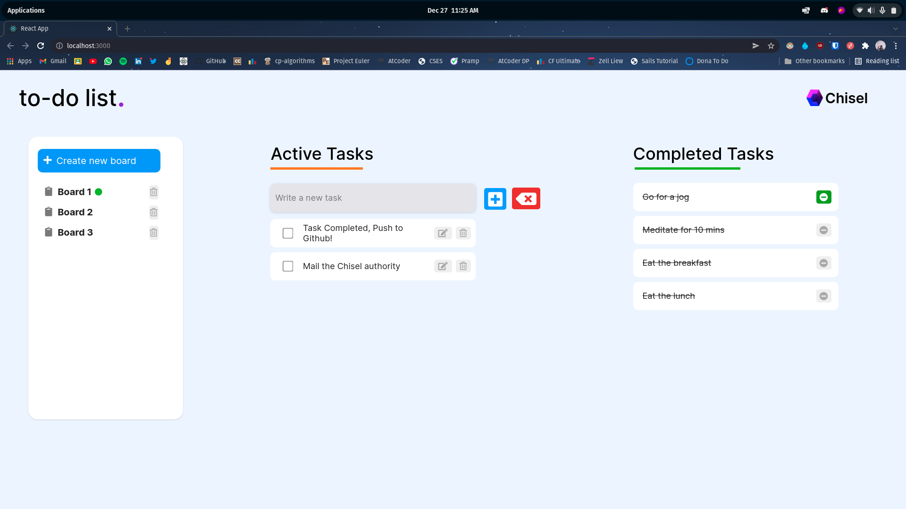

# chisel-to-do-frontend

## Available Scripts -

In the project directory, you can run:

### `npm start`

Runs the app in the development mode.\
Open [http://localhost:3000](http://localhost:3000) to view it in your browser.

The page will reload when you make changes.\
You may also see any lint errors in the console.

### `npm test`

Launches the test runner in the interactive watch mode.\

### `npm run build`

Builds the app for production to the `build` folder.\
It correctly bundles React in production mode and optimizes the build for the best performance.

The build is minified and the filenames include the hashes.\
Your app is ready to be deployed!

 

# How to view my to-do assignment!

1. Install all dependencies using `npm install`
2. Clone the backend file repository to local, Go to Config/Datastores.js, and edit the Adapater with your local Postgres Database server and It would just work fine.
3. Start the backend server using `sails lift`
4. Start React using npm start and you'd be able to see my task.

 

## Frontend Repository -

https://github.com/anikxt/chisel-to-do-frontend

## Backend Repository -

https://github.com/anikxt/chisel-to-do-backend

 

# Proof of Work:

